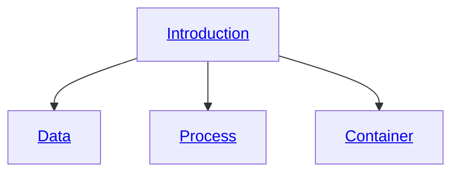

```mermaid
graph TD
    App[<a href='index.html#README'>Introduction </a>]
    Data[<a href='index.html#data_content'>Data </a>]
    Process[<a href='index.html#info_process'>Process </a>]
    Capsule[<a href='index.html#content_process'>Container </a>]
    App --> Data
    App --> Process
    App --> Capsule
```

