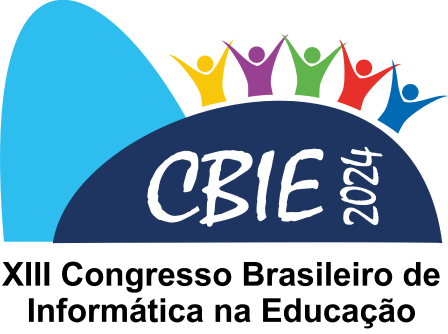

<!---
Open Source program Pynoplia - Copyright © 2024  Carlo Oliveira** <carlo@nce.ufrj.br>,
PDX-License-Identifier:** `GNU General Public License v3.0 or later <http://is.gd/3Udt>`_.
-->
# JAIE 2024 - Vivendo e Aprendendo a Jogar
> E agora para algo totalmente diferente!  
> Aprenda Python resolvendo, modificando e criando jogos e desafios.  

## Exploração - Olhando Horizontes

A fase começa com uma reunião em pé de cinco minutos onde
são exploradas as expectativas e propostas dos participantes.
Nos quartos teremos uma visão rápida da linguagem Python e da
biblioteca Vitollino criada para facilitar a criação de jogos usando esta metodologia.

Seguir para [Exploração - Olhando Horizontes](explora)

## Formalização - O Jogo Pessoal
Seguindo o Guia do Desenvolvedor temos a aventura “Os Agentes da J.A.I.E - O Caso do Relógio”.
Na reunião em pé discutimos a diretriz conceitual da franquia “Os Agentes”.
Neste caso, os agentes vão investigar uma mensagem numa garrafa achada
por pescadores numa praia remota. Será pensado um mapa das “tomadas de cena”
dentro do cenário e o “corte do diretor” para este episódio.
Nesta fase todos trabalham individualmente e tentam construir uma proposta para o jogo.

Seguir para [Formalização - O Jogo Pessoal](formal)

## Refinamento - O Processo Coletivo
Nesta fase temos um conjunto de propostas e protótipos construídos pelos participantes.
Na reunião em pé vamos dividir a turma em quatro grupos e tentar fazer um produto mínimo com quatro conceitos.
Os grupos vão construir “tomadas” relativas ao tema escolhido dentre Matemática, Ciência, Linguagem e História.
Cada tema vai ser divido em cerca de quatro tarefas que serão distribuídas entre os participantes.
Cada equipe produzirá o seu próprio jogo e plataforma já dispõe de uma engenharia para unir
as partes distribuídas em um único executável.

Seguir para [Refinamento - O Processo Coletivo](refina)

## Reflexão - Conhecendo os Pares
Com quatro jogos prontos podemos revisar os trabalhos uns dos outros.
Na reunião vamos nos propor a construir um único jogo. Os jogos dos grupos
devem se unir para formar um jogo coeso e funcional.
O trabalho se aproxima do exemplo completo fornecido no “Guia do Agente”,
mas com uma nova visão, o “corte do diretor”.

Seguir para [Reflexão - Conhecendo os Pares](reflex)

## Instanciação - Aprendendo ao Jogar
O jogo final está pronto, mas o quanto dá para jogar? Os participantes tentam cobrir
todas as missões e avaliar se o resultado está coerente.
Hora de jogar o seu próprio jogo ou como se diz “comer a sua própria comida de cachorro”

Seguir para [Instanciação - Aprendendo ao Jogar](insta)

# Considerações sobre o processo
Devido ao ritmo acelerado para apresentar um vislumbre do que seria um período de dez meses em cinco horas,
muita coisa está pronta no “Guia do Agente”. O processo se parece mais com um contínuo “copia e cola”
onde vale mais a escolha do que copiar e onde colar. No entanto, isto guarda uma grande semelhança
com o processo usado pelo desenvolvedor moderno, com a diferença que o guia é uma fonte confiável
e direcionada para o entendimento do que se está fazendo

[footer](footer.md ':include')