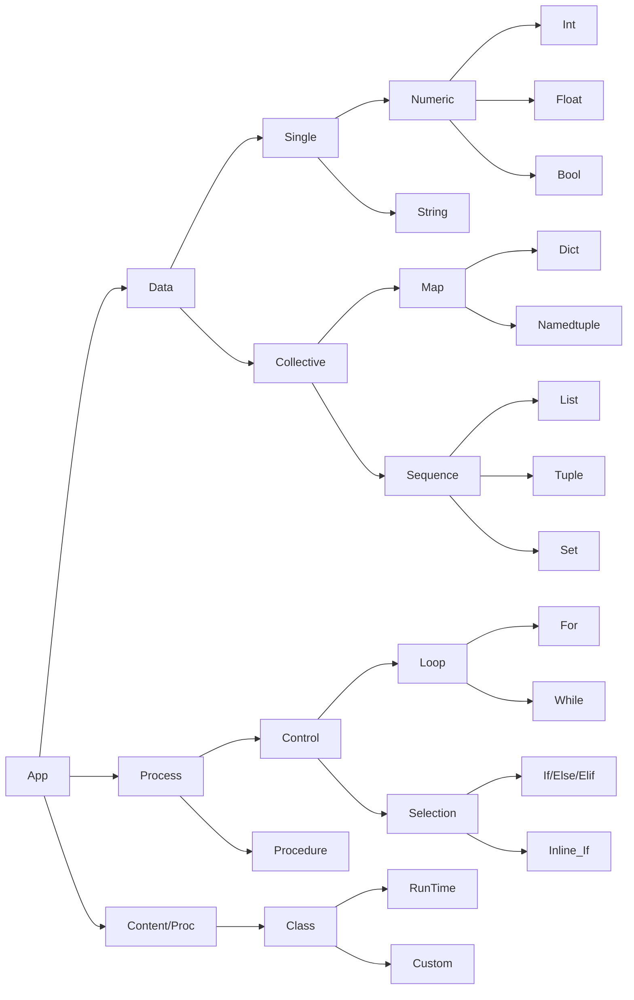

# Python Element Map
>Web page of SuPyPerson, a place to persons wanting to learn Python

| [Data Content](data_content.md) | [Information Processing](data_content.md) | [home](README.md) |
|---------------------------------|-------------------------------------------|-------------------|
