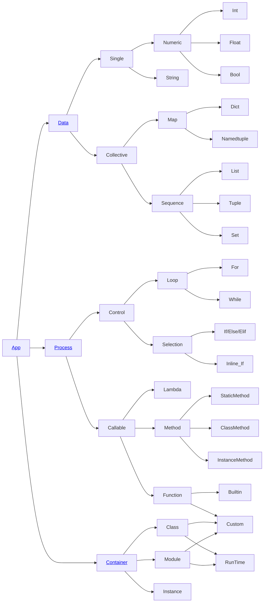

# Python Element Map
>Elements for the Python Programming Language

```mermaid
graph LR
    Data[<a href='index.html#data_content'>Data</a>]
    App[<a href='index.html#README'>App</a>]
    Process[<a href='index.html#info_process'>Process</a>]
    Content/Proc[<a href='index.html#content_process'>Container</a>]
    App --> Data
    App --> Process
    App --> Content/Proc
    Data --> Single
    Data --> Collective
    Single --> Numeric
    Single --> String
    Numeric --> Int
    Numeric --> Float
    Numeric --> Bool
    Collective --> Map
    Map --> Dict
    Map --> Namedtuple
    Collective --> Sequence
    Sequence --> List
    Sequence --> Tuple
    Sequence --> Set
    Process --> Control
    Process --> Callable
    Control --> Loop
    Control --> Selection
    Loop --> For
    Loop --> While
    Selection --> If/Else/Elif
    Selection --> Inline_If
    Callable --> Lambda
    Callable --> Method
    Callable --> Function
    Method --> StaticMethod
    Method --> ClassMethod
    Method --> InstanceMethod
    Function --> Builtin
    Function --> Custom
    Content/Proc --> Class
    Content/Proc --> Module
    Content/Proc --> Instance
    Class --> RunTime
    Class --> Custom
    Module --> RunTime
    Module --> Custom
```

[footer](footer.md ':include')