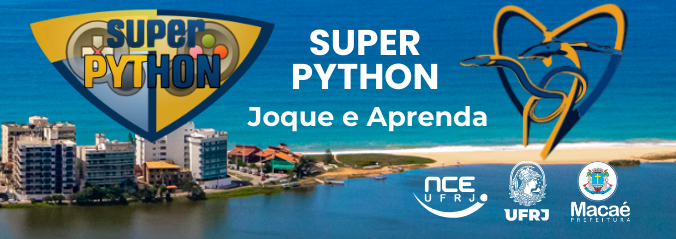

<!---
Open Source program Pynoplia - Copyright © 2024  Carlo Oliveira** <carlo@nce.ufrj.br>,
PDX-License-Identifier:** `GNU General Public License v3.0 or later <http://is.gd/3Udt>`_.
-->
# Secretaria Municipal de Educação 2025 - Vivendo e Aprendendo a Jogar
> E agora para algo totalmente diferente!  
> Aprenda Python resolvendo, modificando e criando jogos e desafios.  
 

#### LABASE
[footer](footer.md ':include')